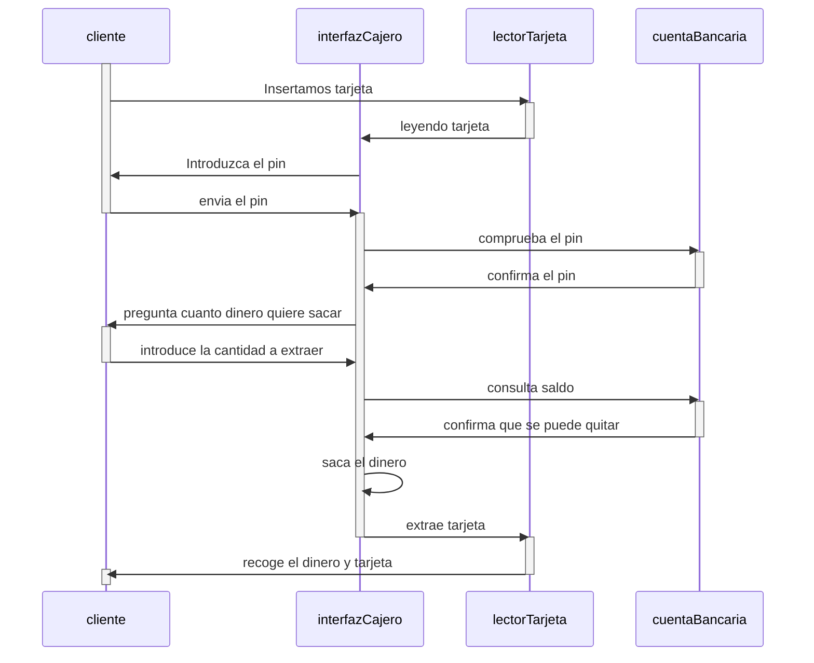

Elabora un documento en markdown que incluya lo siguiente:

El código del diagrama de secuencia.

Descripción del diagrama elaborado.

El primera paso sería insertar la tarjeta

El segundo paso sería que la interfaz del cajero diga algo de leyendo tarjeta

El tercero sería que te pida introducir el pin

El cuarto sería que tu introduzcan el pin y lo envies

El quinto es la interfaz grafica contrasta tu pin contra la cuenta bancaria

El sexto si es correcto te permite hacer la operación de quitar saldo

El septimo te pregunta cuanto dinero quieres

El octavo indicas la cantidad

El noveno es que consulta la cantidad introducidad contra el saldo de tu cuenta
bancaria

El decimo confirma que tu saldo no se queda en negativo y te devuelve el mensaje de todo correcto en la interfaz

El undecimo paso consistiría en que la interfaz del cajero empieza quitar dinero

El duodecimo es que la interfaz de cajero te saca la tarjeta del lector

El decimotercero es que tu recoges el dinero y la tarjeta